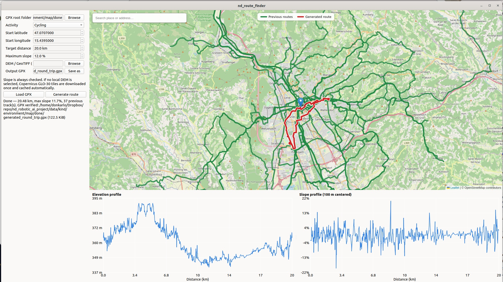

# nd_route_finder

A round-trip route finder for cycling and hiking.

The application takes previously travelled GPX routes, a start point, a target
distance, and a maximum allowed slope as input. It generates a round-trip route
that tries to maximize the distance from previously traversed routes while
satisfying the routing, access, and slope constraints.




## Main behavior

- Recursively reads previous GPX tracks from the selected GPX root folder.
- Lets you choose `Cycling` or `Hiking`.
- Lets you choose the start point by clicking the map or entering latitude and
  longitude manually.
- Generates a round trip close to the requested distance.
- Treats the requested maximum slope as a mandatory constraint.
- Prefers routes that remain as far as possible from previously travelled GPX
  tracks.
- Filters access restrictions, unbridged fords, mapped water crossings without
  a bridge, and mapped blocked barriers without an opening.
- Draws previous GPX tracks and the generated route with different styles.
- Shows resizable elevation and slope profile panels after route generation.
- Shows the corresponding route position on the map while the mouse moves over
  either profile chart.
- Loads an existing GPX route on demand and shows its elevation and slope
  profiles when the GPX contains elevation data.


## Quick usage

1. Select the root folder containing previously travelled GPX tracks.
2. Choose `Cycling` or `Hiking`.
3. Select the start point by clicking on the map or entering latitude and
   longitude manually.
4. Enter the desired round-trip distance.
5. Enter the maximum allowed slope.
6. Optionally select a local DEM/GeoTIFF file.
7. Select the output GPX path.
8. Generate the route.
9. Resize the profile area or the two profile panels by dragging the splitter
   handles.
10. Move the mouse over either profile to locate that point on the map.

To inspect an existing GPX instead of generating a new route, click `Load GPX`
and select the file. The route is displayed on the map and the same elevation
and slope profile panels are used for inspection.


## Inputs

The route generator uses the following inputs:

- GPX root directory containing previously travelled routes
- Activity type: `Cycling` or `Hiking`
- Start latitude and longitude
- Desired round-trip distance
- Maximum allowed slope
- Optional local DEM/GeoTIFF
- Output GPX path

For profile inspection, a single existing `.gpx` file can also be loaded with
`Load GPX`.


## Output

The application produces a GPX file containing the generated round-trip route.

The generated route is also displayed on the map together with previously
travelled GPX tracks so that the relationship between new and previously
traversed areas can be inspected visually.

After generation, two resizable profile panels are displayed below the map:

- elevation in metres versus travelled distance in kilometres
- slope in percent versus travelled distance in kilometres

Moving the mouse over either chart displays the corresponding position on the
map.


## Routing objective

The main objective is to generate a round trip that explores new areas.

Previously travelled GPX tracks are used as a spatial penalty during route
selection. Candidate routes that remain farther from those tracks are preferred
over routes that repeatedly follow previously travelled paths.

At the same time, the generated route must satisfy constraints such as:

- requested route distance
- maximum allowed slope
- activity type
- access restrictions
- blocked barriers
- unsuitable water crossings


## Elevation and slope

Slope is always evaluated.

If `DEM / GeoTIFF` is left empty, the application automatically downloads the
required Copernicus GLO-30 30 m elevation tile(s) from the public Copernicus DEM
dataset on AWS and caches them under:

```text
~/.cache/nd_route_finder/dem/copernicus_glo30/
```

The same tile is reused on later runs, so elevation is not requested
point-by-point from a public elevation API and the previous HTTP 429 problem is
avoided.

If you select your own DEM/GeoTIFF, that raster is used instead of the automatic
Copernicus download.

The final route is accepted only when its evaluated maximum slope is at or below
the value entered in `Maximum slope`.

Copernicus GLO-30 is a 30 m Digital Surface Model, so the computed value is a
terrain-based slope estimate rather than a survey-grade measurement of the road
surface.

The interactive slope profile uses a centered 100 m window to avoid displaying
point-to-point noise as the local grade. Existing GPX files can be profiled when
they contain elevation values for all route points. If elevation values are
missing, the route is still shown on the map but the application reports that a
reliable elevation or slope profile cannot be calculated from that file.


## GPX output reliability

The GPX output process is designed to prevent incomplete or incorrectly reported
output files.

- The output path is fixed when generation starts.
- Input controls are locked until the generation run finishes.
- GPX output is written atomically through a temporary file and `os.replace`.
- The generated file must exist.
- The generated file must be non-empty.
- The generated file must parse back successfully before the UI reports success.
- The `Output GPX` field is synchronized with the exact verified path returned
  by the writer.


## Map rendering

The Qt WebEngine map is written to a local cached HTML document and loaded with
a file URL.

This avoids Qt WebEngine's `setHtml()` data-URL size limit when many historical
GPX tracks are displayed.

The generated route is drawn as a thick red line with a white outline, while
previously travelled tracks are displayed in gray.

A temporary marker is displayed on the map while a route profile is inspected,
so the chart distance, elevation or slope can be related directly to the route
geometry.


## Project structure

```text
route_finder.py

src/nd_route_finder/
├── analysis/
├── application/
├── domain/
├── entrypoint/
├── geodata/
├── gpx/
├── routing/
└── ui/
```

The Python source follows the project rule of one class per Python file.


## Installation

Install the required Python packages with:

```bash
python -m pip install -r requirements.txt
```


## Running

Run the application with:

```bash
python route_finder.py
```


## Limitations

- Slope values depend on the resolution and accuracy of the elevation model.
- Copernicus GLO-30 has a spatial resolution of approximately 30 m and therefore
  cannot represent every short or highly local road gradient accurately.
- Loaded GPX files need complete elevation values for elevation and slope
  profile visualization.
- Routing quality depends on the completeness and correctness of OpenStreetMap
  data.
- Missing or incorrect OpenStreetMap access, barrier, bridge, or surface
  information can affect route generation.
- A feasible route may not exist for very restrictive combinations of distance,
  maximum slope, access restrictions, and previously travelled areas.
- The requested route distance is a target rather than a guarantee; the final
  distance may differ when necessary to satisfy the mandatory routing
  constraints.
